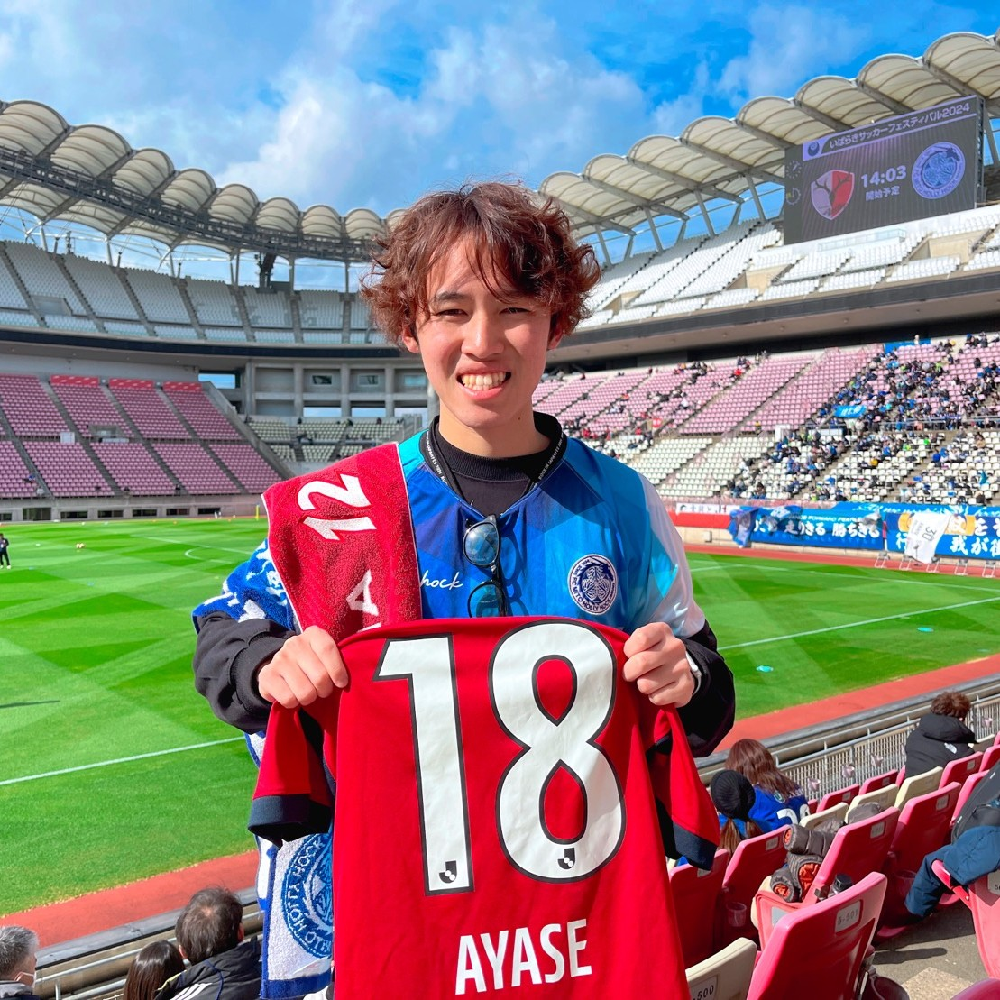

# Portfolio of 7010
[English](https://naotoizu7010.github.io/en)

  
  

# 基本情報

|🏷️|📌|
|---|---|
|氏名|大泉直人 (Naoto Oizumi)|
|居住地|茨城県 つくば市|
|出身|茨城県 日立市|
|所属|筑波大学 理工学群社会工学類 学部4年|

# 学歴
2020.04 - 2023.03  
　　茨城県立 [水戸第一高等学校](https://www.mito1-h.ibk.ed.jp/)（令和5年卒）  
  
2023.04 -  
　　筑波大学 理工学群[社会工学類](https://www.sk.tsukuba.ac.jp/College/index.php) 経営工学主専攻 （[大西研究室](http://onishi-lab.jp/)）  
　　大規模スタジアムにおける人流解析

# 職歴
2026.02 -  
　　[産業技術総合研究所](https: //www.aist.go.jp/aist_j/information/about_aist.html) 人工知能研究センター [社会知能研究チーム](https://www.airc.aist.go.jp/cosine/) テクニカルスタッフ  
　　<a href="https://www.aist.go.jp/aist_j/news/pr20170729.html" style="color: gray; text-decoration: underline;">鹿島アントラーズとの包括協定</a>に関連するプロジェクトを中心とした、人工知能の社会実装に資する研究補助業務

# プロフィールスライド
[こちら](https://naotoizu7010.github.io/profileslide)

# 所属団体等
- 大西研究室（産業技術総合研究所 人工知能研究センター 社会知能研究チーム）（[HP](http://onishi-lab.jp/)）
  - Q. なんで筑波大学じゃなくて産総研で研究しているの？
  - A. 連携大学院制度を使っています（[もっと詳しく](https://staff.aist.go.jp/onishi-masaki/joinus/tsukuba/)）
- OneThing（筑波大学エンジニアコミュニティ） 前代表（[Twitter](https://x.com/OneThingTsukuba)）（[HP](https://onethingtsukuba.github.io/)）（[イベント一覧](https://luma.com/user/OneThingTsukuba)）
  - [LT会開催報告](https://note.com/naotoizu_7010/n/n9d00794c4227)
- STARTiX（筑波大学起業サークル）（[HP](https://startix-tsukuba.net/)）
- 硬式テニス愛好会（テニスサークル）
- 筑波大学 宿舎祭実行委員（[HP](https://yadokarisai.com/)）

# 趣味
- スポーツ観戦
  - 国内サッカー（Ｊリーグ）
    - 水戸ホーリーホック
    - 鹿島アントラーズ
  - 海外サッカー
  - ボクシング
  - 他のスポーツも大好きです
    - 例えば
    - アメフト
    - バスケ
    - スポーツ観戦誘ってください！
  - [ワールドカップ観戦予定スケジュール](https://naotoizu7010.github.io/worldcup2026)
- スポーツ
- ラーメン巡り
- バイク
- サイクリング
- ガジェット
- 金融投資・資産形成
- Wikipediaサーフィン
- 思索
  
[もっとくわしく](https://naotoizu7010.github.io/favorites)

# 最近のnote

<iframe class="note-embed" src="https://note.com/embed/notes/nd02e75c8c307" style="border: 0; display: block; max-width: 99%; width: 494px; padding: 0px; margin: 10px 0px; position: static; visibility: visible;" height="400"></iframe>

<iframe class="note-embed" src="https://note.com/embed/notes/n0a47646648df" style="border: 0; display: block; max-width: 99%; width: 494px; padding: 0px; margin: 10px 0px; position: static; visibility: visible;" height="400"></iframe>

# アカウント一覧

# 連絡方法
- Twitter（X）・インスタのDM
- 研究関連の方
    - Eメール：naoto-oizumi⚽️aist.go.jp  
      （⚽️をアットマークに置き換えてください）

<!--
**naotoizu7010/naotoizu7010** is a ✨ _special_ ✨ repository because its `README.md` (this file) appears on your GitHub profile.

Here are some ideas to get you started:

- 🔭 I’m currently working on ...
- 🌱 I’m currently learning ...
- 👯 I’m looking to collaborate on ...
- 🤔 I’m looking for help with ...
- 💬 Ask me about ...
- 📫 How to reach me: ...
- 😄 Pronouns: ...
- ⚡ Fun fact: ...
-->
